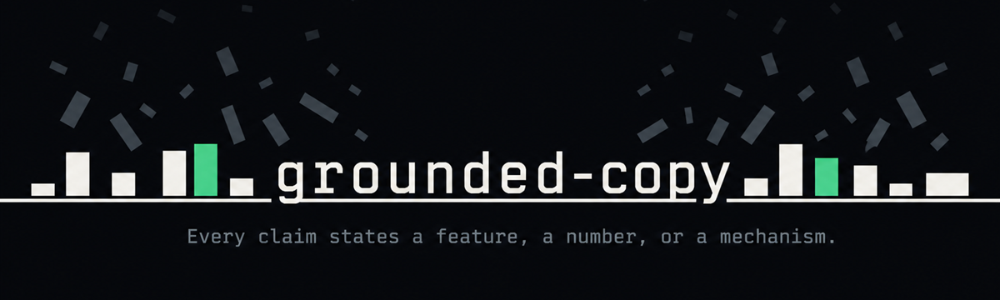

<p align="center">
  
</p>

<p align="center">
  <strong>Writing rules and a copy checker for AI agents.</strong>
</p>

<p align="center">
  <a href="https://github.com/HiroHyun/grounded-copy/actions/workflows/copy-lint.yml"></a>
  <a href="LICENSE"></a>
  <a href="https://www.skills.sh/hirohyun/grounded-copy"></a>
</p>

<p align="center">
  <a href="README.md">English</a> ·
  <a href="README.zh.md">简体中文</a>
</p>

<p align="center">
  <a href="#try-it">Try it</a> ·
  <a href="#install">Install</a> ·
  <a href="#choose-a-writing-mode">Choose a writing mode</a> ·
  <a href="#check-a-file">Check a file</a> ·
  <a href="#before-and-after">Before and after</a> ·
  <a href="#what-to-expect">What to expect</a> ·
  <a href="#more-help">More help</a>
</p>

# grounded-copy

You ask an agent (Claude Code, Codex, Cursor, and other AI coding tools) to write your release notes. It describes the update in broad terms, and you still have to say what changed. `grounded-copy` tells the agent to write about the actual features, steps, and facts. You can also run its Python checker on a saved draft.

Use it when you write product pages, project docs, or everyday replies. Give the agent the facts you want to include and tell it who will read them.

## Try it

After installation, ask your agent:

> Write the release notes for version 2.1 of our scheduling app. It adds Google Calendar sync, cuts export time from 40 seconds to 4 seconds, and fixes the duplicate-invite bug. The readers are existing customers. Use grounded-copy, then run the copy checker on the result.

For a product page, supply the details the copy needs:

> Write a short description of our task tracker. It links tasks to pull requests and posts a summary to Slack each morning. Use grounded-copy.

The agent uses the writing rules to draft and review the text. The checker reports phrases that match its rules. You review whether the result is accurate and reads naturally.

## Install

The installer needs Python 3 and Node.js with `npx`. It installs plugins for Claude Code and Codex when it finds their CLIs. It also runs the Skills CLI to install the skill for supported agents.

**macOS, Linux, WSL, or Git Bash:**

```bash
curl -fsSL https://raw.githubusercontent.com/HiroHyun/grounded-copy/main/install.sh | sh
```

**Windows PowerShell:**

```powershell
irm https://raw.githubusercontent.com/HiroHyun/grounded-copy/main/install.ps1 | iex
```

To choose one installation method, use the commands below.

| Install for | Commands |
|---|---|
| Claude Code | `claude plugin marketplace add HiroHyun/grounded-copy`<br>`claude plugin install grounded-copy@hirohyun-plugins -s user` |
| Codex | `codex plugin marketplace add HiroHyun/grounded-copy`<br>`codex plugin add grounded-copy@hirohyun-plugins` |
| Agents supported by the Skills CLI | `npx skills add HiroHyun/grounded-copy --skill grounded-copy --yes` |

The skill includes the rules, examples, and checker. The Claude Code and Codex plugins also load rules at session start and add a reminder with each prompt. These plugins let you save a writing mode.

See [setup](skills/grounded-copy/references/setup.md) for installation checks, Windows help, and removal commands.

<details>
<summary><strong>More ways in</strong> · installer flags, what each method gives you, a known name collision</summary>

<br>

From a clone of this repository, the installer takes these flags:

```bash
sh install.sh --dry-run
python3 install.py --skills-only
python3 install.py --uninstall
```

| What you get | Skills CLI | Claude Code and Codex plugin |
|---|:---:|:---:|
| The rules, examples, and checker, in nine languages | yes | yes |
| Rules loaded at session start, and again after the session is compacted (`SessionStart`) |  | yes |
| A reminder added with each prompt (`UserPromptSubmit`) |  | yes |
| A writing mode saved between sessions |  | yes |
| A command to switch the mode |  | yes |

If you install both ways on one machine, Claude Code can show `grounded-copy@skills-dir` as `Not loaded`. The plugin provides the skill and the hooks in that case.

</details>

## Choose a writing mode

The plugins call these modes *profiles*. Your choice stays saved after a restart.

| Profile | Use it for |
|---|---|
| `chat` (default) | Everyday replies, documentation, and technical explanations. |
| `copy` | Product pages and marketing text. Adds rules for promotional wording. |
| `off` | Work that needs the original wording or a different writing style. |

**Claude Code:**

```text
/grounded-copy:grounded chat
/grounded-copy:grounded copy
/grounded-copy:grounded off
```

Use `/grounded-copy:grounded` to see the current profile.

**Codex:**

```text
$grounded-profile chat
$grounded-profile copy
$grounded-profile off
$grounded-profile status
```

> [!IMPORTANT]
> **For a faithful translation, set `off` first.** The rules can otherwise prompt the agent to remove a comparison that belongs to the original text. Your explicit instructions take priority over the skill.

<details>
<summary><strong>What each mode costs</strong> · bytes added per session, the turn reminder, where the choice is saved</summary>

<br>

| Profile | Bytes added at session start | Turn reminder |
|---|---:|---|
| `chat` (default) | 3,900 | one line naming `chat` |
| `copy` | 5,452 | one line naming `copy` |
| `off` | 0 | none |

Those counts are the rules themselves. The hook adds 106 more bytes for its header and switch line, and the turn reminder is 218 bytes.

The choice is saved in `<config-dir>/grounded-copy/profile`.

> [!TIP]
> **Some ordinary phrases also match the rules.** The `without-gerund` rule reports any `-ing` noun after `without`. Use `off` when the task requires wording that the style rules would reject.

</details>

## Check a file

From a clone of this repository, run:

```bash
python3 skills/grounded-copy/scripts/copy_lint.py draft.md
```

Use `python` if that is your Python 3 command. You can pass several file paths in one call. The checker uses the Python standard library.

Each finding gives a line number, a rule name, and the matched text. Revise the sentence using the facts in your source, then run the command again.

| Exit code | Meaning |
|---|---|
| `0` | The checker found no matches. |
| `1` | The file contains wording to review. |
| `2` | The command arguments or a file could not be read correctly. |

For a Codex plugin installation, the checker is also in the plugin cache:

```bash
python3 ~/.codex/plugins/cache/hirohyun-plugins/grounded-copy/<version>/skills/grounded-copy/scripts/copy_lint.py draft.md
```

Use the version shown by `codex plugin list` in place of `<version>`.

## Before and after

These are made-up examples. Use facts you can verify in your own copy. The first column deliberately contains phrases the checker reports.

| Draft | Rewrite |
|---|---|
| "More than just a project tracker." | "The tracker links tasks to pull requests and posts a summary to Slack each morning." |
| "Acme is a partner, not a vendor." | "Your account manager joins your planning meeting each quarter." |
| "Acme covers every channel — email, live chat, phone, and the help centre — with one queue." | "Acme puts email, live chat, phone, and help centre requests in one queue." |

The [pattern guide](skills/grounded-copy/references/patterns.md) has more examples.

<details>
<summary><strong>Seven drafts and the rule each one reports</strong></summary>

<br>

The rule column gives the rule name the checker prints for that draft.

| Draft | Rewrite | Rule |
|---|---|---|
| "More than just a project tracker." | "The tracker links tasks to pull requests and posts a summary to Slack each morning." | `more-than-just` |
| "Acme is a partner, not a vendor." | "Your account manager joins your planning meeting each quarter." | `comma-not-appositive` |
| "Acme covers every channel — email, live chat, phone, and the help centre — with one queue." | "Acme puts email, live chat, phone, and help centre requests in one queue." | `dash-pair-list` |
| "It's not a task list. It's a workflow." | "Each task moves through review, and the tracker marks it done." | `opener-it-is-not` |
| "The tracker sends a summary rather than a full report." | "The tracker sends a five-line summary each morning." | `rather-than` |
| "We answer tickets instead of filing them." | "We reply to every ticket within four business hours." | `instead-of` |
| "Experts agree the tracker saves time." | "Teams on the tracker closed 18% more issues last quarter, in our 2026 customer survey." | `vague-experts` |

</details>

## What to expect

The plugin gives the agent instructions. It does not scan or block each chat reply. Run the checker on saved files when you need a repeatable check.

A passing result means the text matched none of the checker's patterns. It does not verify facts or guarantee natural writing. Some ordinary phrases also match the rules. Review the meaning before you change them; use `off` when the task requires wording that the style rules would reject.

The checker covers English, Chinese, Japanese, Korean, Russian, Spanish, Arabic, French, and German. English has the most detailed rules. Chinese, Japanese, and Korean checks include sentence patterns. The other languages use phrase lists. Most checks run one line at a time, so a phrase split over two lines can be missed. The check for lists between paired dashes also works across lines in a paragraph.

<details>
<summary><strong>Language coverage in detail</strong> · 58 English rules, sentence patterns, phrase lists</summary>

<br>

| Languages | What the checker matches |
|---|---|
| English | 58 rules |
| Chinese, Japanese, Korean | sentence patterns, plus a list of phrases |
| Russian, Spanish, Arabic, French, German | a list of 6 to 18 phrases each |

Some ordinary Japanese and Korean phrases also match; `ja-not-just` and `ko-not-just` report those.

</details>

## More help

- [Setup](skills/grounded-copy/references/setup.md): profiles, troubleshooting, and project checks.
- [Writing rules](skills/grounded-copy/SKILL.md): the instructions the agent reads.
- [Pattern guide](skills/grounded-copy/references/patterns.md): phrases to review and sample rewrites.
- [Contributing](CONTRIBUTING.md): how to propose changes.
- [License](LICENSE): AGPL-3.0-only. Copyright 2026 HiroHyun. Releases through 0.5.2 were published under the MIT license.
