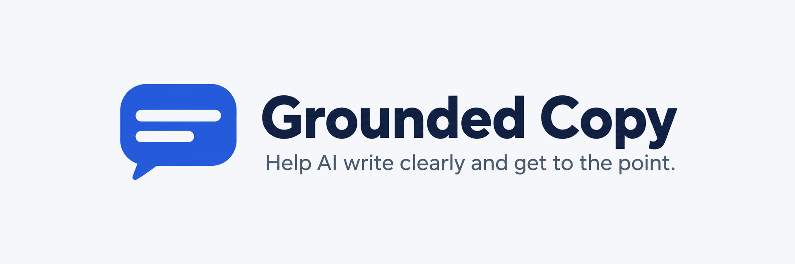

<p align="center">
  
</p>

<p align="center">
  <a href="https://github.com/HiroHyun/grounded-copy/actions/workflows/copy-lint.yml"></a>
  <a href="LICENSE"></a>
  <a href="https://www.skills.sh/hirohyun/grounded-copy"></a>
</p>

<p align="center">
  <a href="README.md">English</a> ·
  <a href="README.zh.md">简体中文</a>
</p>

<p align="center">
  <a href="#try-it">Try it</a> ·
  <a href="#install">Install</a> ·
  <a href="#choose-a-writing-mode">Choose a writing mode</a> ·
  <a href="#before-and-after">Before and after</a> ·
  <a href="#more-help">More help</a>
</p>

# grounded-copy

`grounded-copy` makes an AI assistant state the fact and get to the point, in chat replies and in the documents it writes. A separate mode covers product pages and marketing copy.

## Try it

After installing, start a new chat and ask your question. For product pages or marketing copy, switch to `copy` mode first.

## Install

The installer needs Python 3 and Node.js with `npx`. It adds the plugin to Claude Code and Codex when it finds them, and installs the skill for other agents through the Skills CLI.

**macOS, Linux, WSL, or Git Bash:**

```bash
curl -fsSL https://raw.githubusercontent.com/HiroHyun/grounded-copy/main/install.sh | sh
```

**Windows PowerShell:**

```powershell
irm https://raw.githubusercontent.com/HiroHyun/grounded-copy/main/install.ps1 | iex
```

To install for one agent:

| Install for | Commands |
|---|---|
| Claude Code | `claude plugin marketplace add HiroHyun/grounded-copy`<br>`claude plugin install grounded-copy@hirohyun-plugins -s user` |
| Codex | `codex plugin marketplace add HiroHyun/grounded-copy`<br>`codex plugin add grounded-copy@hirohyun-plugins` |
| Agents supported by the Skills CLI | `npx skills add HiroHyun/grounded-copy --skill grounded-copy --yes` |

The plugins apply the rules in every chat and save your writing mode. A skill on its own loads when the agent judges it relevant.

See [setup](skills/grounded-copy/references/setup.md) for installation checks, Windows help, and removal.

## Choose a writing mode

Your choice stays saved after a restart.

| Mode | Use it for |
|---|---|
| `chat` (default) | Everyday interaction and ordinary document processing. |
| `copy` | Product pages, marketing copy, and similar text. |
| `off` | Work that needs the original wording or a different writing style. |

**Claude Code:**

```text
/grounded-copy:grounded chat
/grounded-copy:grounded copy
/grounded-copy:grounded off
```

Use `/grounded-copy:grounded` to see the current mode.

**Codex:**

```text
$grounded-profile chat
$grounded-profile copy
$grounded-profile off
$grounded-profile status
```

> [!IMPORTANT]
> **For a faithful translation, set `off` first.** The rules can otherwise prompt the agent to remove a comparison that belongs to the original text.

## Before and after

| Draft | With grounded-copy |
|---|---|
| "The file isn't missing, it's empty." | "The file is empty." |
| "Rinse the rice rather than skipping that step." | "Rinse the rice." |
| "Use olive oil instead of butter." | "Use olive oil." |
| "More than just a project tracker." | "The tracker links tasks to pull requests and posts a summary to Slack each morning." |
| "Experts agree the tracker saves time." | "Teams on the tracker closed 18% more issues last quarter, in our 2026 customer survey." |

The [pattern guide](skills/grounded-copy/references/patterns.md) has more examples.

## More help

- [Setup](skills/grounded-copy/references/setup.md): installation checks, checking a file, and troubleshooting.
- [Writing rules](skills/grounded-copy/SKILL.md): the instructions the agent reads.
- [Pattern guide](skills/grounded-copy/references/patterns.md): phrases to review and sample rewrites.
- [Contributing](CONTRIBUTING.md): how to propose changes.
- [License](LICENSE): AGPL-3.0-only. [NOTICE](NOTICE) carries the copyright.
